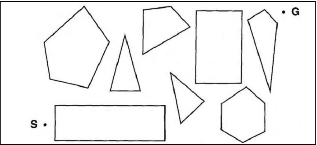
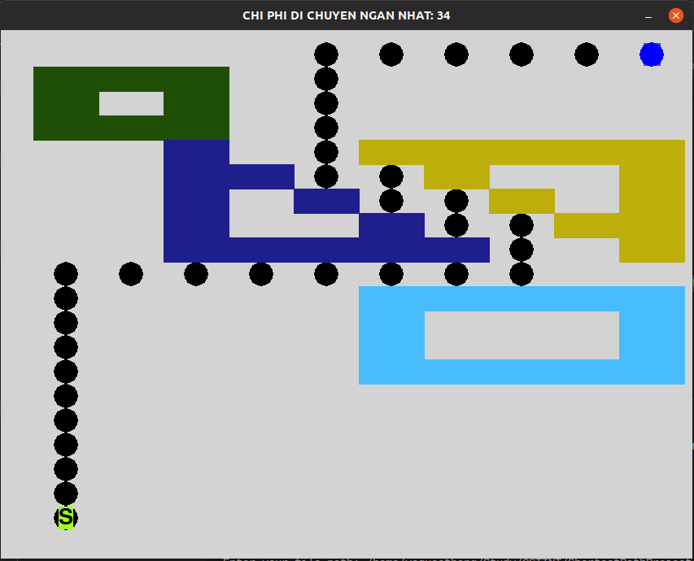
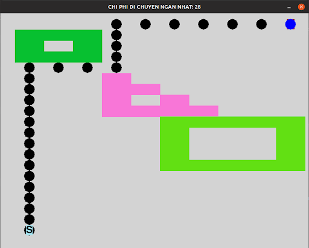
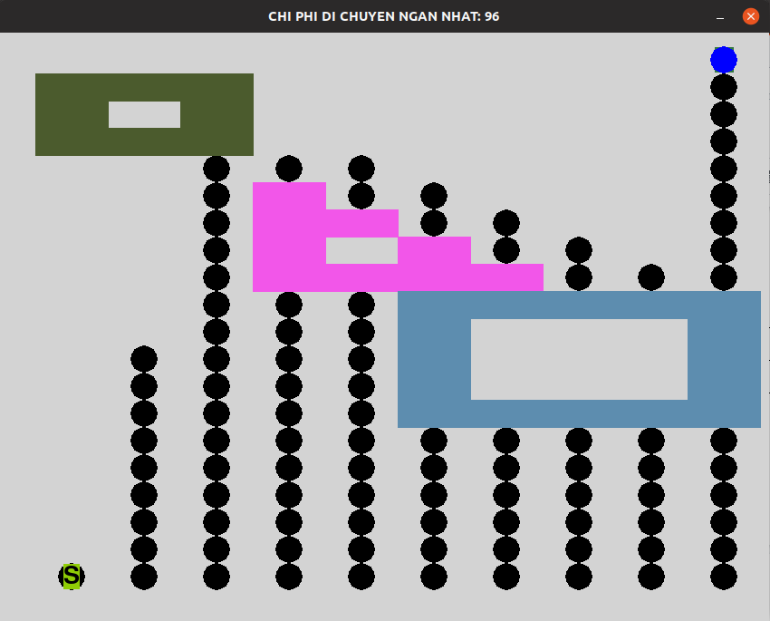
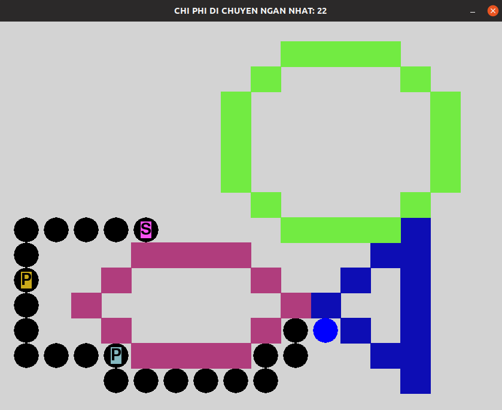

# Applying path finding algorithm in Python
School project on implementing path finding algorithm in Python3 and Pygame 
## Table of contents:
* [Problem](#problem)
* [Path finding algorithm](#pathfinding-algorithm)
* [Demo](#demo)
* [How to use](#how-to-use)
## Problem 
You are given a map in xOy coordinate system. On that map, there are two points and a number of polygons. Your job is to find the shortest path to move from one point to another point without bumping into any polygons. If it is impossible to find such path, print "No solution" ,otherwise you should print the path itself. 

Note that : polygons should not overlay with each other.


Beside that, there are some levels to finish this problem: 
* Level 1: Implementing only one path finding algorithm
* Level 2: Implementing three pathfinding algorithm and comparing their performances
* Level 3: Along the road, you also have to visit some points before you reach the goal.Implementing one algorithm in this situation.
* Level 4: Implementing one algorithm in the situation where polygons can move around the map.
## Path finding algorithm 
### A* search 
### BFS 
### DFS 
## Demo
### Level 1 : A * search 

### Level 2 : Applying three algorithm : A * search, Breath-First search and Depth-First search
#### A* search 


#### BFS 

#### DFS 

### Level 3: Visting points

### Level 4: Moving polygons 
[](https://youtu.be/48cSOiGZuwo)
## How to use 
* Download python3.7
* Install pygame 
* Download src folder 
* Run this on your commnad line

```
python3 main.py
```

There is a menu popping up on your ternminal: 

```
1. level 1
2. level 2
3. level 3
4. level 4
5. Press 0 to exit
Level: (choose your level you want to execute)
Enter your file path: (Enter the path where your input.txt located)
````

After a second,The result will show up on a popup windows
