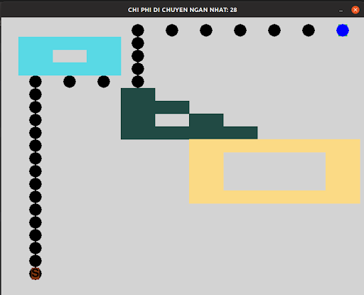

# Applying searching algorithm in Python
School project on implementing searching algorithm in Python3 and Pygame 
## Table of contents:
* [Problem](#problem)
* [Searching algorithm](#searching-algorithm)
* [Demo](#demo)
* [Setup](#setup)
## Problem 
You are given a map in xOy coordinate system. On that map, there are two points and a number of polygons. Your job is to find the shortest path to move from one point to another point without bumping into any polygons. If it is impossible to find such path, print "No solution" ,otherwise you should print the path itself. 

Note that : polygons should not overlay with each other.

Beside that, there are some levels to finish this problem: 
* Level 1: Implementing only one searching algorithm
* Level 2: Implementing three searching algorithm and comparing their performances
* Level 3: Along the road, you also have to visit some points before you reach the goal.Implementing one algorithm in this situation.
* Level 4: Implementing one algorithm in the situation where polygons can move around the map.
## Searching algorithm 
### A* search 
### BFS 
### DFS 
## Demo
### Level 1 : A * search 

### Level 2 : Applying three algorithm : A * search, Breath-First search and Depth-First search
#### A* search 

#### BFS 

#### DFS 

### Level 3: Visting points

### Level 4: Moving polygons 

## Assignment: https://docs.google.com/document/d/1JTLTkssX6G6HsH4HEDVw75ihP5P4a6jsaDm4urtqYro/edit
## Main Docs: https://docs.google.com/spreadsheets/d/1IrroFEv30Hc_tlQWwlEUv6piI6VWk1d3FAFVNH2tXqM/edit?usp=sharing
